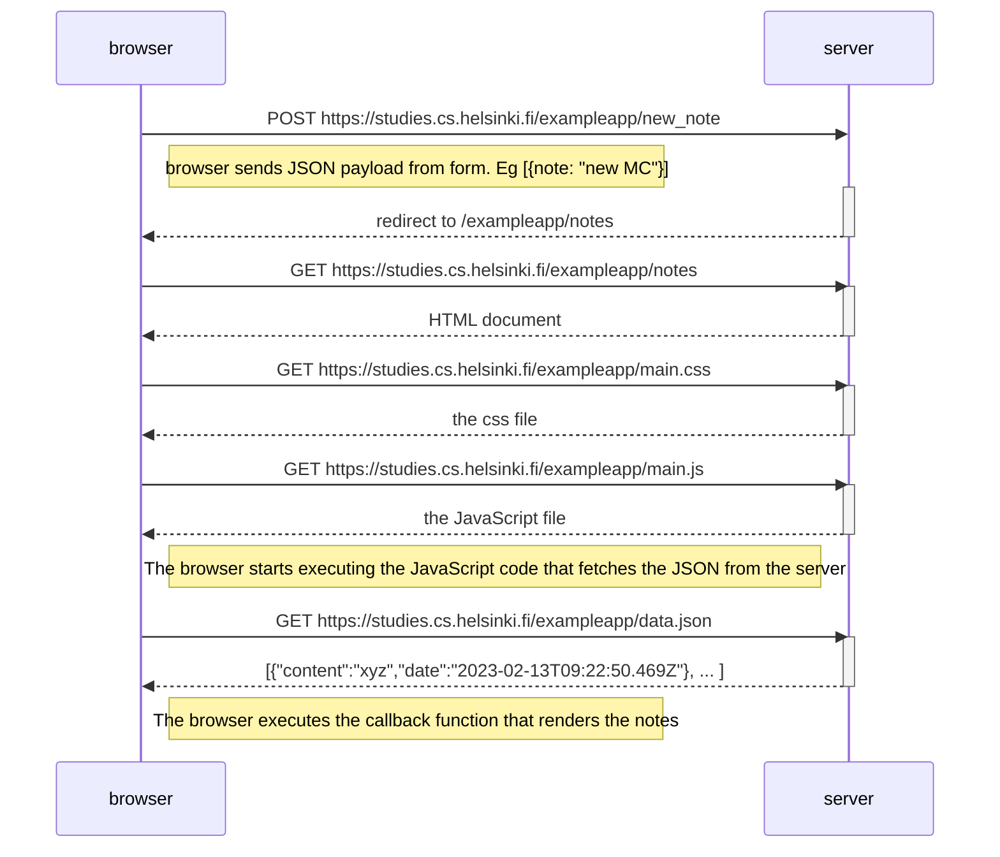

<h2>0.4 New note diagram</h2>

```mermaid
sequenceDiagram
    participant browser
    participant server

    browser->>server: POST  https://studies.cs.helsinki.fi/exampleapp/new_note
    Note right of browser: browser sends JSON payload from form. Eg [{note: "new MC"}]
    activate server
    server-->>browser: redirect to /exampleapp/notes
    deactivate server

    browser->>server: GET https://studies.cs.helsinki.fi/exampleapp/notes
    activate server  
    server-->>browser: HTML document
    deactivate server

    browser->>server: GET https://studies.cs.helsinki.fi/exampleapp/main.css
    activate server
    server-->>browser: the css file
    deactivate server
    
    browser->>server: GET https://studies.cs.helsinki.fi/exampleapp/main.js
    activate server
    server-->>browser: the JavaScript file
    deactivate server

    Note right of browser: The browser starts executing the JavaScript code that fetches the JSON from the server
    
    browser->>server: GET https://studies.cs.helsinki.fi/exampleapp/data.json
    activate server
    server-->>browser: [{"content":"xyz","date":"2023-02-13T09:22:50.469Z"}, ... ]
    deactivate server    

    Note right of browser: The browser executes the callback function that renders the notes 
```
