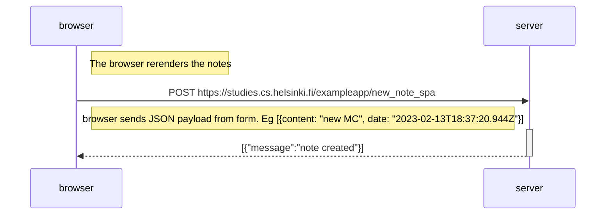

<h2>0.6 New note SPA diagram</h2>

```mermaid
sequenceDiagram
    participant browser
    participant server

    Note right of browser: The browser rerenders the notes 

    browser->>server: POST https://studies.cs.helsinki.fi/exampleapp/new_note_spa
    Note right of browser: browser sends JSON payload from form. Eg [{content: "new MC", date: "2023-02-13T18:37:20.944Z"}]
    activate server  
    server-->>browser:  [{"message":"note created"}]
    deactivate server
    

```